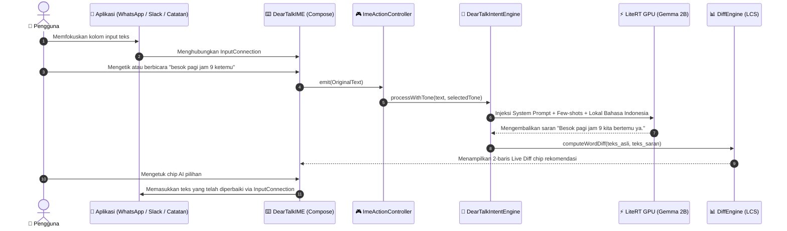

# ✨ DearTalkAI: Papan Ketik Android AI 100% On-Device (IME)

<div align="center">

<p align="center">
  <a href="README.md">English</a> |
  <a href="README.ko.md">한국어</a> |
  <b>Bahasa Indonesia</b>
</p>

[-3DDC84?logo=android&logoColor=white)](#-fitur-utama-papan-ketik-android)
[](#-prinsip-utama-rekayasa)
[-success)](#-jaminan-privasi--keamanan-mutlak)
[](LICENSE)

**DearTalkAI** adalah asisten komunikasi AI sumber terbuka (open-source) yang mengutamakan privasi dan berjalan 100% langsung di dalam perangkat (on-device) tanpa koneksi internet, dibangun sebagai **Papan Ketik Kustom Android (IME)**.

Mengoptimalkan teks ketikan dan input suara luring (offline STT) dengan penyesuaian nada bicara secara real-time, koreksi kesalahan ketik, dan terjemahan multibahasa — ditenagai sepenuhnya oleh model neural lokal Google Gemma melalui LiteRT GPU.

[Fitur Utama](#-fitur-utama-papan-ketik-android) • [Contoh Perubahan Nada](#-contoh-transformasi-nada-bicara) • [Arsitektur Sistem](docs/ARCHITECTURE.md) • [Peta Jalan](docs/ROADMAP.md) • [Pengujian](docs/TESTING.md) • [Panduan Kontribusi](CONTRIBUTING.md)

</div>

---

## 📊 Status Rilis Platform

| Komponen | Versi | Target SDK | Status | Fitur Utama |
| :--- | :---: | :---: | :---: | :--- |
| 🤖 **DearTalk Android IME** | `v1.0.6` | **Android 16 (API 36)** | **Produksi Stabil (Production Stable)** | Target SDK 36, UX Pasangan Bahasa 1-Ketuk, Pembalikan Otomatis Cerdas 2-Arah (Auto-Swap), Mesin TTS Sesuai Aksara, Voice Studio & Penerjemah Langsung |

---

## 🌟 Fitur Utama Papan Ketik Android

### 🎙️ AI Voice Studio & Penerjemah Langsung (`VoiceStudioActivity`)
- **Studio Layar Penuh Terisolasi Memori:** Aktivitas mandiri yang menjalankan alur kerja STT ➔ LLM ➔ TTS secara berurutan tanpa membebani memori keyboard IME.
- **Pemilih Bahasa 2-Arah & Tukar 1-Ketuk:** Arsitektur `[ 🗣️ Bahasa Bicara ] ⇄ [ 🌐 Bahasa Terjemahan ]` dengan pembalikan arah percakapan instan.
- **Mesin Terjemahan Dinamis Tanpa Hardcoding:** Prompt penerjemah simultan peka konteks untuk 12 bahasa dengan integrasi model akustik lokal.
- **Kustomisasi Suara & Kontrol Nada:** Pilihan vokal Wanita/Pria dan 4 tingkat nada (`Normal`, `Bass Dalam`, `Sedang Hangat`, `Tinggi Cerah`).
- **Pemutaran Ulang Audio 0ms:** Putar ulang audio instan saat mengetuk ikon speaker tanpa inferensi ulang LLM (`speakDirectly`).

### 📱 Papan Ketik Android (`deartalk-android`)
- **Android 15 & Target SDK 35:** Arsitektur UI modular modern berbasis Jetpack Compose yang ringan dan elegan.
- **Papan Ketik Standar Responsif Bahasa:** Pemilihan tata letak otomatis berdasarkan bahasa aktif (Hangul 2-set untuk Korea, Latin QWERTY untuk bahasa lain).
- **Pengenalan Suara Luring (Offline STT):** Dikte suara instan langsung di dalam papan ketik tanpa jaringan internet.
- **6 Pilihan Nada Bicara:** `✨ Rapikan`, `👔 Sopan`, `😊 Santai`, `💼 Profesional`, `🤣 Lucu`, dan `😼 Percaya Diri`.
- **Preservasi Suara Asli (Raw STT):** Mengganti nada bicara tetap menjaga teks suara asli tanpa merusaknya.
- **0ms UI Optimistik & Kartu Peralihan Keyboard:** Umpan balik visual seketika dan peralihan satu ketukan ke keyboard Samsung/Gboard.
- **UI Kaca Gelap Elegan:** Tema Slate modern, layar pengaturan khusus, lingkungan uji coba (sandbox), dan umpan balik haptic.
- **Standar Play Asset Delivery (PAD) & Diagnosis Perangkat:** Evaluasi keamanan RAM 3 tingkat dan pengelolaan aset On-Demand Google Play (fitur hapus paket 1-ketuk).
- **Dukungan Multibahasa Penuh:** Dukungan lokal Bahasa Indonesia, Korea, Inggris, Jepang, dan Spanyol dengan pembentukan prompt dinamis.

---

## 🎭 Contoh Transformasi Nada Bicara

| Pilihan Nada | Teks Masukan Asli | Saran AI On-Device |
|---|---|---|
| **✨ Rapikan (Refine)** | besok pagi jam 9 ketemu | Besok pagi jam 9 kita bertemu ya. |
| **👔 Sopan (Polite)** | mau makan bareng ga? | Apakah Anda berkenan untuk makan bersama? |
| **😊 Santai (Casual)** | kamu lagi dimana? | Lagi di mana nih sekarang? 😊 |
| **💼 Profesional (Business)** | data udah dikirim tolong cek | Dokumen yang diminta sudah kami kirimkan, mohon ditinjau kembali. |
| **🤣 Lucu (Funny)** | ayo makan siang | Gak makan siang itu melanggar hukum lapar! Yuk makan bareng 🤣 |
| **😼 Percaya Diri (Cheeky)** | main yuk hari ini | Kosongin jadwalmu hari ini, aku luangkan waktu khusus buatmu 😼 |

---

## 🔄 Cara Kerja (How It Works)



---

## 🔒 Jaminan Privasi & Keamanan Mutlak

1. **Tanpa Aturan Palsu (Prinsip Utama):**
   - Tidak ada manipulasi string `if/else` atau templat buatan. Semua hasil dihasilkan murni oleh model bahasa on-device (Google Gemma).
2. **Privasi 100% Offline (Zero Network):**
   - Nol lalu lintas internet. Ketikan keyboard, rekaman suara, dan teks tidak pernah meninggalkan perangkat Anda.
3. **Transparansi Rekayasa:**
   - Status yang jujur saat model sedang dimuat tanpa balasan tiruan palsu.

---

## 🚀 Memulai Cepat & Kompilasi

```bash
# 🚀 1. Jalankan pengujian otomatis lengkap pra-PR (Unit Tests + Uji Stres Perangkat 500 Event)
make verify            # atau ./verify.sh all

# 🧪 2. Jalankan pengujian unit JVM saja (< 2 detik)
make test              # atau ./verify.sh unit

# 📱 3. Jalankan audit kestabilan dan kebocoran memori perangkat nyata
make verify-device     # atau ./verify.sh device

# 🔨 4. Kompilasi dan pasang Debug APK pada perangkat yang terhubung
make build             # atau ./verify.sh build

# 📦 5. Kompilasi Release App Bundle (AAB) untuk Play Store
make release           # atau ./verify.sh release
```

---

## 🤝 Kontribusi & Komunitas

Kami sangat menyambut kontribusi dari komunitas global! Silakan baca:
- [Panduan Kontribusi](CONTRIBUTING.md)
- [Arsitektur Sistem](docs/ARCHITECTURE.md)
- [Panduan Pengujian & Verifikasi](docs/TESTING.md)
- [Panduan Penerbitan Android](docs/ANDROID_DEPLOYMENT_GUIDE.md)
- [Kebijakan Keamanan](SECURITY.md)

---

## 📄 Lisensi (License)
Proyek ini dilisensikan di bawah **Apache 2.0 License** - lihat berkas [LICENSE](LICENSE) untuk rincian lengkap.
