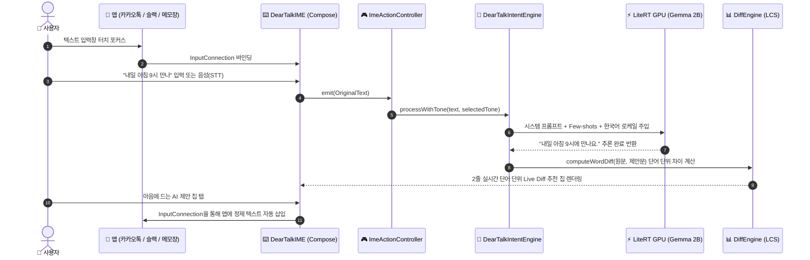

# ✨ DearTalkAI: 100% 온디바이스 AI 안드로이드 키보드 (IME)

<div align="center">

<p align="center">
  <a href="README.md">English</a> |
  <b>한국어</b> |
  <a href="README.id.md">Bahasa Indonesia</a>
</p>

[-3DDC84?logo=android&logoColor=white)](#-안드로이드-키보드-주요-기능)
[](#-핵심-엔지니어링-원칙)
[-success)](#-완벽한-개인정보-보호-보증)
[](LICENSE)

**DearTalkAI**는 외부 네트워크 연결 없이 사용자 기기 내부에서 100% 동작하는 오픈소스 온디바이스 AI **안드로이드 커스텀 키보드(IME)**입니다.

타이핑한 텍스트와 오프라인 음성 입력(STT)을 실시간으로 분석하여, 문맥에 맞는 6종 어조 변환, 맞춤법 교정, 다국어 번역을 완전한 보안 환경에서 즉시 제공합니다. (Google Gemma LiteRT GPU 온디바이스 추론 탑재)

[주요 기능](#-안드로이드-키보드-주요-기능) • [어조 변환 예시](#-어조-변환-사례) • [시스템 아키텍처](docs/ARCHITECTURE.md) • [기술 로드맵](docs/ROADMAP.md) • [검증 및 테스트](docs/TESTING.md) • [기여 가이드](CONTRIBUTING.md)

</div>

---

## 📊 플랫폼 릴리즈 현황

| 컴포넌트 | 버전 | Target SDK | 출시 상태 | 핵심 변경사항 |
| :--- | :---: | :---: | :---: | :--- |
| 🤖 **DearTalk Android IME** | `v1.0.4` | **Android 15 (API 35)** | **상용 안정화 버전 (Production Stable)** | 온디바이스 Voice Studio & 실시간 대면 통역기, 2-Way 언어 맞바꾸기, PAD On-Demand 생명주기, RAM 사전 진단, 로케일 반응형 쿼티 자판, LiteRT GPU |

---

## 🌟 안드로이드 키보드 주요 기능

### 🎙️ AI Voice Studio & 실시간 대면 통역기 (`VoiceStudioActivity`)
- **메모리 격리 독립 풀스크린 스튜디오:** 키보드 IME 프로세스의 메모리 안정성을 위해 분리된 전용 액티비티에서 직렬 STT ➔ LLM ➔ TTS 파이프라인 안전 구동.
- **2-Way 양방향 언어 바 & 원터치 맞바꾸기:** `[ 🗣️ 말할 언어 (STT 입력) ] ⇄ [ 🌐 번역 언어 (TTS 출력) ]` 구조 및 탭 한 번으로 대화 방향 즉시 전환.
- **Zero-Hardcoding 동적 통역 엔진:** 12개 언어 간 문맥 맞춤형 동시통역 프롬프트 생성 및 언어별 음향 모델(Acoustic Model) 완벽 바인딩.
- **보이스 & 피치 커스터마이저:** 여성/남성 음성 선택 및 4단계 피치 조절 (`보통`, `중후한 저음`, `부드러운 중음`, `밝은 고음`).
- **0ms 즉각 다시 듣기:** 스피커 탭 시 LLM 재연산 없이 오디오 즉시 재생(`speakDirectly`).

### 📱 커스텀 키보드 (`deartalk-android`)
- **Android 15 & Target SDK 35 완벽 대응:** 최신 모듈형 Jetpack Compose 기반의 가볍고 미려한 UI.
- **로케일 반응형 표준 키보드:** 활성 언어에 따라 한글 2벌식 및 영문/다국어 QWERTY 자동 분기 매핑.
- **오프라인 음성 인식 (STT):** 외부 서버 통신 없이 키보드 자체에서 즉각적인 온디바이스 음성 입력.
- **6종 통합 어조 프리셋:** `✨ 기본다듬기`, `👔 공손하게`, `😊 친근하게`, `💼 비즈니스`, `🤣 재미있게`, `😼 당당하게`.
- **원문 음성 보존 (Raw STT):** 여러 어조를 번갈아 눌러도 최초 원문 음성을 영구 보존하며 실시간 재교정.
- **0ms 즉각 반응(Optimistic UI) & 키보드 전환 카드:** 탭 즉시 하이라이트 반영 및 삼성/Gboard 원터치 전환 지원.
- **다크 글래스모피즘 UI:** 세련된 Slate UI, 전용 설정 화면, 대화형 샌드박스 및 햅틱 피드백.
- **Play Asset Delivery (PAD) & 하드웨어 진단:** 3단계 RAM 진단 및 Google Play On-Demand 수명주기 관리(1-Click 용량 삭제 연동).
- **완벽한 다국어 현지화:** 한국어, 영어, 인도네시아어, 일본어, 스페인어 로케일 동적 프롬프트 생성 지원.

---

## 🎭 어조 변환 사례

| 어조 프리셋 | 사용자가 입력한 원문 | 온디바이스 AI 제안문 |
|---|---|---|
| **✨ 기본다듬기 (Refine)** | 내일 아침 9시 만나 | 내일 아침 9시에 만나요. |
| **👔 공손하게 (Polite)** | 식사 같이 하실래요? | 혹시 식사 함께 하실 수 있으실까요? |
| **😊 친근하게 (Casual)** | 지금 어디야? | 지금 어디쯤이야? 😊 |
| **💼 비즈니스 (Business)** | 자료 정리해서 보냈어 확인해 | 요청하신 업무 자료 송부해 드렸으니 확인 부탁드립니다. |
| **🤣 재미있게 (Funny)** | 밥 먹으러 가자 | 밥 먹으러 안 가면 유죄! 같이 맛있는 거 먹으러 가요 🤣 |
| **😼 당당하게 (Cheeky)** | 오늘 나랑 놀자 | 오늘 시간 비워둬, 내가 특별히 만나줄 테니까 😼 |

---

## 🔄 작동 원리 (How It Works)



---

## 🔒 완벽한 개인정보 보호 보증

1. **Zero Fake Hardcoding (제1원칙):**
   - 어떠한 가짜 문자열 조작이나 규칙 기반 트릭을 쓰지 않으며, 모든 결과는 100% 온디바이스 Google Gemma LLM 추론으로만 생성됩니다.
2. **100% 오프라인 동작 (Zero Network):**
   - 외부 네트워크 트래픽 0%. 키 입력, 음성 데이터, 변환 텍스트가 단 1바이트도 기기 밖으로 나가지 않습니다.
3. **투명한 엔지니어링 상태:**
   - 모델 로딩 중에는 가짜 답변 대신 정직한 상태 라벨을 표시하고 원문을 100% 보존합니다.

---

## 🚀 빠른 시작 및 실행

```bash
# 🚀 1. Pre-PR 전수 자동화 검증 (단위테스트 + 실기기 500회 스트레스 감사)
make verify            # 또는 ./verify.sh all

# 🧪 2. JVM 단위 테스트만 실행 (< 2초)
make test              # 또는 ./verify.sh unit

# 📱 3. 실기기 자동화 안정성 & 메모리 누수 감사
make verify-device     # 또는 ./verify.sh device

# 🔨 4. 디버그 APK 빌드 및 연결된 기기 자동 설치
make build             # 또는 ./verify.sh build

# 📦 5. 릴리즈 배포용 App Bundle (AAB) 빌드
make release           # 또는 ./verify.sh release
```

---

## 🤝 기여 및 커뮤니티

전 세계 모든 개발자의 기여를 진심으로 환영합니다!
- [기여 가이드 (Contributing)](CONTRIBUTING.md)
- [시스템 아키텍처 (Architecture)](docs/ARCHITECTURE.md)
- [통합 검증 가이드 (Testing)](docs/TESTING.md)
- [안드로이드 배포 가이드](docs/ANDROID_DEPLOYMENT_GUIDE.md)
- [보안 정책 (Security)](SECURITY.md)

---

## 📄 라이선스 (License)
본 프로젝트는 **Apache 2.0 라이선스** 하에 자유롭게 사용 및 배포할 수 있습니다 - 상세 내용은 [LICENSE](LICENSE)를 참조하세요.
