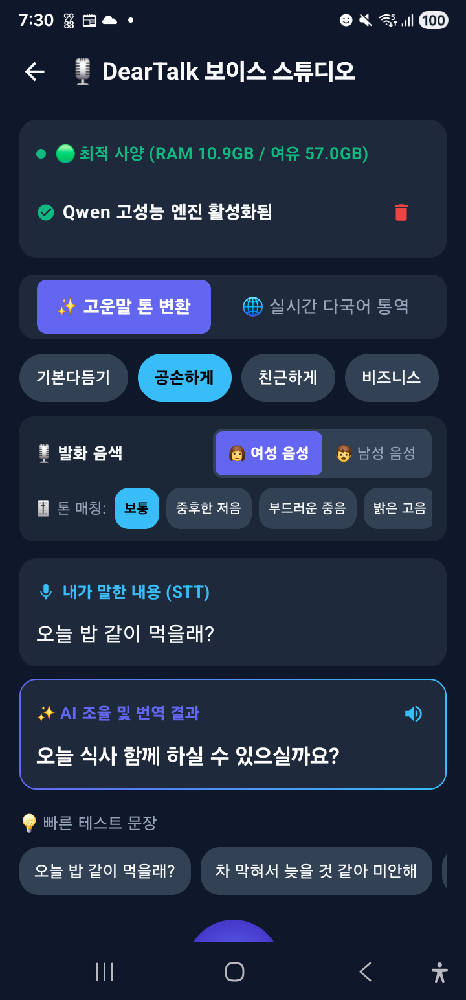
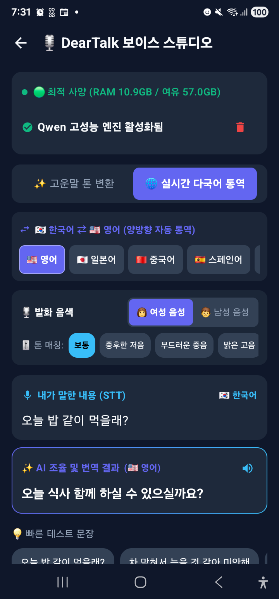
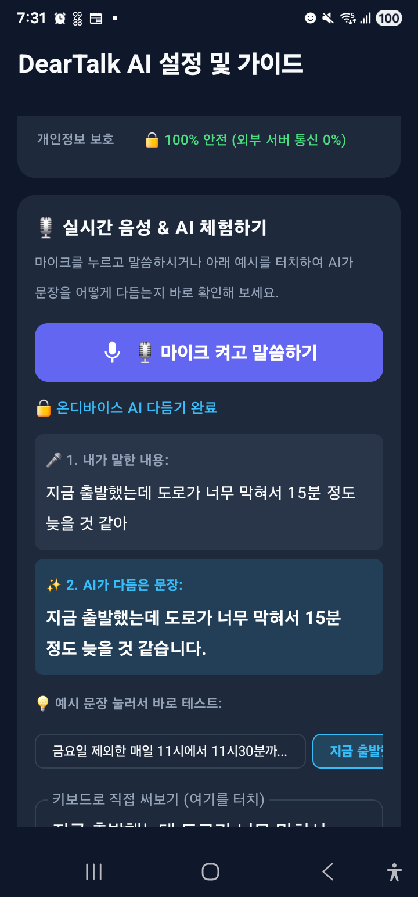
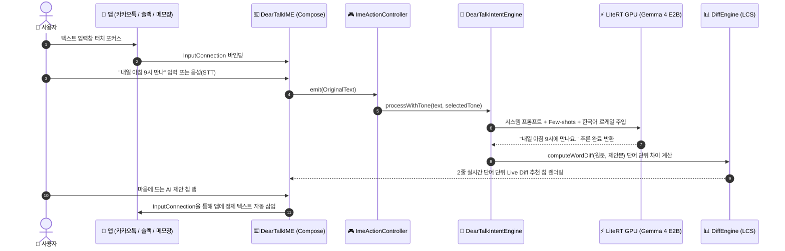

# ✨ 디어톡(DearTalk) AI 음성키보드 (DearTalk Voice Keyboard): 100% 온디바이스 AI 키보드 (IME)

<div align="center">

<p align="center">
  <a href="README.md">English</a> |
  <b>한국어</b> |
  <a href="README.id.md">Bahasa Indonesia</a>
</p>

[-3DDC84?logo=android&logoColor=white)](#-안드로이드-키보드-주요-기능)
[](#-핵심-엔지니어링-원칙)
[-success)](#-완벽한-개인정보-보호-보증)
[](#-cobuild-ai-패밀리-앱-생태계--p2p-메쉬-모델-볼트)
[](LICENSE)

**디어톡(DearTalk) AI 음성키보드 (DearTalk Voice Keyboard)**는 외부 네트워크 연결 없이 사용자 기기 내부에서 100% 동작하는 오픈소스 온디바이스 AI **안드로이드 커스텀 키보드(IME)**입니다.

타이핑한 텍스트와 오프라인 음성 입력(STT)을 실시간으로 분석하여, 문맥에 맞는 6종 어조 변환, 맞춤법 교정, 자연스러운 문맥 다듬기를 완전한 보안 환경에서 즉시 제공합니다. (Google Gemma LiteRT GPU 온디바이스 추론 탑재)

[주요 기능](#-안드로이드-키보드-주요-기능) • [어조 변환 예시](#-어조-변환-사례) • [시스템 아키텍처](docs/ARCHITECTURE.md) • [기술 로드맵](docs/ROADMAP.md) • [검증 및 테스트](docs/TESTING.md) • [기여 가이드](CONTRIBUTING.md)

</div>

---

## 📊 플랫폼 릴리즈 현황

| 컴포넌트 | 버전 | Target SDK | 출시 상태 | 핵심 변경사항 |
| :--- | :---: | :---: | :---: | :--- |
| 🤖 **디어톡(DearTalk) AI 음성키보드** | `v1.2.2` | **Android 16 (API 36)** | **공개 테스트 (Open Testing - Beta)** | 3단계 온보딩 마법사, Day & Night 프리미엄 듀얼 테마, 마이크 권한 자동 복구, 100% 온디바이스 Zero-Network Gemma 4 E2B |

---

## 📱 온디바이스 AI 실기기 쇼케이스 (Samsung Galaxy S22 Ultra)

| 🎙️ 보이스 스튜디오 & 고운말 톤 스피킹 | 🏛️ P2P 메쉬 모델 볼트 | 🔒 온디바이스 프라이버시 & 대화형 샌드박스 |
| :---: | :---: | :---: |
|  |  |  |
| **0ms 즉각 음성 톤 조율**<br>날것의 구어체 발화(*"오늘 밥 같이 먹을래?"*)를 정중하고 단정한 표현(*"오늘 식사 함께 하실 수 있으실까요?"*)으로 즉각 교정. | **저장공간 중복 0MB (P2P Vault)**<br>패밀리 앱(**디어톡(DearTalk) 음성 통역기**, **DearMind**)과 온디바이스 SLM 모델(Gemma 4 E2B)을 안전하게 공유하여 용량 낭비 원천 차단. | **100% 에어갭 안심 샌드박스**<br>외부 네트워크 전송 0% (`🔒 100% 안전 - 외부 서버 통신 0%`). 내 스마트폰 내부에서만 완벽히 격리 실행. |

---

## 🌟 안드로이드 키보드 주요 기능

### 🏛️ Cobuild AI 패밀리 앱 생태계 & P2P 메쉬 모델 볼트
- **독립 통역 앱 분리:** 대화 상호작용 및 통역 기능의 몰입도를 극대화하기 위해 1:1 대면 실시간 통역기는 **[디어톡(DearTalk) 음성 통역기 (`ai.deartalk.translator`)](../deartalk-translator)**로 완전 독립 분리되었습니다.
- **Cobuild AI P2P 메쉬 모델 볼트:** `디어톡(DearTalk) AI 음성키보드`와 `디어톡(DearTalk) 음성 통역기`(및 `DearMind`)는 Android `signature` 보호 권한 기반의 `ContentProvider`를 통해 기기 내 1.5GB~2.4GB 모델을 1회만 저장하고 무손실 제로카피로 공유합니다.
- **원터치 패밀리 런처:** 키보드 설정 내 패밀리 앱 섹션을 통해 통역기 및 마음 케어 일기 앱으로 언제든 즉시 이동/설치 가능합니다.

### 📱 커스텀 키보드 (`deartalk-android`)
- **Android 15 & Target SDK 35 완벽 대응:** 최신 모듈형 Jetpack Compose 기반의 가볍고 미려한 UI.
- **로케일 반응형 표준 키보드:** 활성 언어에 따라 한글 2벌식 및 영문/다국어 QWERTY 자동 분기 매핑.
- **오프라인 음성 인식 (STT):** 외부 서버 통신 없이 키보드 자체에서 즉각적인 온디바이스 음성 입력.
- **6종 통합 어조 프리셋:** `✨ 기본다듬기`, `👔 공손하게`, `😊 친근하게`, `💼 비즈니스`, `🤣 재미있게`, `😼 당당하게`.
- **원문 음성 보존 (Raw STT):** 여러 어조를 번갈아 눌러도 최초 원문 음성을 영구 보존하며 실시간 재교정.
- **0ms 즉각 반응(Optimistic UI) & 키보드 전환 카드:** 탭 즉시 하이라이트 반영 및 삼성/Gboard 원터치 전환 지원.
- **다크 글래스모피즘 UI:** 세련된 Slate UI, 전용 설정 화면, 대화형 샌드박스 및 햅틱 피드백.
- **Play Asset Delivery (PAD) & 하드웨어 진단:** 3단계 RAM 진단 및 Google Play On-Demand 수명주기 관리(1-Click 용량 삭제 연동).
- **완벽한 다국어 현지화:** 한국어, 영어, 인도네시아어, 일본어, 스페인어 로케일 동적 프롬프트 생성 지원.

---

## 🎭 어조 변환 사례

| 어조 프리셋 | 사용자가 입력한 원문 | 온디바이스 AI 제안문 |
|---|---|---|
| **✨ 기본다듬기 (Refine)** | 내일 아침 9시 만나 | 내일 아침 9시에 만나요. |
| **👔 공손하게 (Polite)** | 식사 같이 하실래요? | 혹시 식사 함께 하실 수 있으실까요? |
| **😊 친근하게 (Casual)** | 지금 어디야? | 지금 어디쯤이야? 😊 |
| **💼 비즈니스 (Business)** | 자료 정리해서 보냈어 확인해 | 요청하신 업무 자료 송부해 드렸으니 확인 부탁드립니다. |
| **🤣 재미있게 (Funny)** | 밥 먹으러 가자 | 밥 먹으러 안 가면 유죄! 같이 맛있는 거 먹으러 가요 🤣 |
| **😼 당당하게 (Cheeky)** | 오늘 나랑 놀자 | 오늘 시간 비워둬, 내가 특별히 만나줄 테니까 😼 |

---

## 🔄 작동 원리 (How It Works)


```mermaid
sequenceDiagram
    autonumber
    actor User as 👤 사용자
    participant HostApp as 📱 앱 (카카오톡 / 슬랙 / 메모장)
    participant IME as ⌨️ DearTalkIME (Compose)
    participant Controller as 🎮 ImeActionController
    participant Engine as 🧠 DearTalkIntentEngine
    participant LLM as ⚡ LiteRT GPU (Gemma 4 E2B)
    participant Diff as 📊 DiffEngine (LCS)

    User->>HostApp: 텍스트 입력창 터치 포커스
    HostApp->>IME: InputConnection 바인딩
    User->>IME: "내일 아침 9시 만나" 입력 또는 음성(STT)
    IME->>Controller: emit(OriginalText)
    Controller->>Engine: processWithTone(text, selectedTone)
    Engine->>LLM: 시스템 프롬프트 + Few-shots + 한국어 로케일 주입
    LLM-->>Engine: "내일 아침 9시에 만나요." 추론 완료 반환
    Engine->>Diff: computeWordDiff(원문, 제안문) 단어 단위 차이 계산
    Diff-->>IME: 2줄 실시간 단어 단위 Live Diff 추천 칩 렌더링
    User->>IME: 마음에 드는 AI 제안 칩 탭
    IME->>HostApp: InputConnection을 통해 앱에 정제 텍스트 자동 삽입
```

---

## 🔒 완벽한 개인정보 보호 보증

1. **Zero Fake Hardcoding (제1원칙):**
   - 어떠한 가짜 문자열 조작이나 규칙 기반 트릭을 쓰지 않으며, 모든 결과는 100% 온디바이스 Google Gemma LLM 추론으로만 생성됩니다.
2. **100% 오프라인 동작 (Zero Network):**
   - 외부 네트워크 트래픽 0%. 키 입력, 음성 데이터, 변환 텍스트가 단 1바이트도 기기 밖으로 나가지 않습니다.
3. **투명한 엔지니어링 상태:**
   - 모델 로딩 중에는 가짜 답변 대신 정직한 상태 라벨을 표시하고 원문을 100% 보존합니다.

---

## 📁 저장소 디렉토리 구조

```text
deartalk-ai/
├── deartalk-android/           # Android IME 모듈 (Jetpack Compose UI)
│   ├── src/main/java/ai/deartalk/android/
│   │   ├── agent/              # 온디바이스 Gemma LiteRT 엔진 및 프롬프트 템플릿
│   │   ├── ime/                # InputMethodService, 컨트롤러 및 한글 오토마타
│   │   ├── data/               # SQLite 저장소, 설정 및 다국어 리소스
│   │   ├── ui/                 # 모듈식 Compose 컴포넌트, 설정 및 샌드박스
│   │   └── stt/                # 오프라인 음성인식(SpeechRecognizer) 매니저
│   └── src/test/               # JVM 단위 테스트 (오토마타, 프롬프트 빌더, diff)
│
├── docs/                       # 아키텍처, 테스트 및 배포 가이드 문서
│   ├── ARCHITECTURE.md         # 시스템 아키텍처 및 데이터 흐름 명세서
│   ├── TESTING.md              # 자동화 테스트 및 실기기 검증 가이드
│   ├── MODELS.md               # 온디바이스 LiteRT SLM 명세서
│   ├── ROADMAP.md              # 장기 릴리즈 마일스톤 및 로드맵
│   └── ANDROID_DEPLOYMENT_GUIDE.md # 구글 플레이 PAD 및 배포 가이드
│
├── scripts/                    # 자동화 테스트 및 디바이스 검증 스크립트
│   └── verify_device_stability.py # ADB Monkey 스트레스 및 메모리 누수 감사기
│
├── Makefile                    # 표준 개발자 타겟 (make verify, make test)
└── verify.sh                   # 대화형 무결점 검증 실행기
```

---

## 🚀 빠른 시작 및 실행

```bash
# 🚀 1. Pre-PR 전수 자동화 검증 (단위테스트 + 실기기 500회 스트레스 감사)
make verify            # 또는 ./verify.sh all

# 🧪 2. JVM 단위 테스트만 실행 (< 2초)
make test              # 또는 ./verify.sh unit

# 📱 3. 실기기 자동화 안정성 & 메모리 누수 감사
make verify-device     # 또는 ./verify.sh device

# 🔨 4. 디버그 APK 빌드 및 연결된 기기 자동 설치
make build             # 또는 ./verify.sh build

# 📦 5. 릴리즈 배포용 App Bundle (AAB) 빌드
make release           # 또는 ./verify.sh release
```

---

## 🤝 기여 및 커뮤니티

전 세계 모든 개발자의 기여를 진심으로 환영합니다!
- [기여 가이드 (Contributing)](CONTRIBUTING.md)
- [시스템 아키텍처 (Architecture)](docs/ARCHITECTURE.md)
- [통합 검증 가이드 (Testing)](docs/TESTING.md)
- [안드로이드 배포 가이드](docs/ANDROID_DEPLOYMENT_GUIDE.md)
- [보안 정책 (Security)](SECURITY.md)

---

## 📄 라이선스 (License)
본 프로젝트는 **Apache 2.0 라이선스** 하에 자유롭게 사용 및 배포할 수 있습니다 - 상세 내용은 [LICENSE](LICENSE)를 참조하세요.
