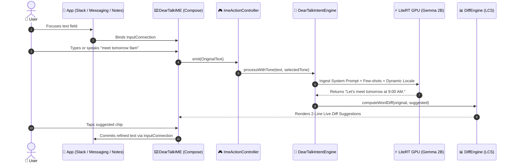

# ✨ DearTalkAI: 100% On-Device AI Android Keyboard (IME)

<div align="center">

<p align="center">
  <b>English</b> |
  <a href="README.ko.md">한국어</a> |
  <a href="README.id.md">Bahasa Indonesia</a>
</p>

[-3DDC84?logo=android&logoColor=white)](#-key-platform-features)
[](#-core-principles)
[-success)](#-privacy--security-guarantee)
[](LICENSE)
[](https://github.com/smilelife/deartalk-ai/actions)

**DearTalkAI** is an open-source, privacy-first, 100% on-device AI communication assistant built as an **Android Custom Keyboard (IME)**.

It refines typed text and spoken voice (STT) with real-time, context-aware tone adjustments, typo correction, and multilingual translations — powered strictly by local on-device neural networks (Google Gemma via LiteRT GPU) without any network connection.

[Key Features](#-key-platform-features) • [Before & After Samples](#-tone-transformation-samples) • [Architecture](docs/ARCHITECTURE.md) • [Long-Term Roadmap](docs/ROADMAP.md) • [Model Specs](docs/MODELS.md) • [Testing](docs/TESTING.md) • [Contributing](CONTRIBUTING.md)

</div>

---

## 📊 Release Status

| Component | Version | Target SDK | Status | Primary Highlights |
| :--- | :---: | :---: | :---: | :--- |
| 🤖 **DearTalk Android IME** | `v1.0.7` | **Android 16 (API 36)** | **Production Stable** | Samsung One UI Navigation Bar Padding Fix, STT Speech Loop Fix, Target SDK 36, 1-Tap Partner Language Pair UX, Smart Auto-Swap |

---

## 🌟 Key Platform Features

### 🎙️ AI Voice Studio & Live Interpreter (`VoiceStudioActivity`)
- **Memory-Isolated Full-Screen Studio:** Independent activity executing sequential STT ➔ LLM ➔ TTS pipelines safely away from the IME memory space.
- **2-Way Language Selector & 1-Tap Reverse:** `[ 🗣️ Spoken Input ] ⇄ [ 🌐 Target Output ]` architecture with instant conversation swap.
- **Zero-Hardcoding Dynamic Translation:** Context-aware simultaneous interpreter engine supporting 12 languages with custom acoustic model bindings.
- **Voice Customizer & Pitch Control:** Female/Male vocal selector and 4-tier pitch calibration (`Normal`, `Deep Low`, `Warm Mid`, `Bright High`).
- **Zero-Latency Audio Replay:** Instant audio replay on speaker tap bypassing LLM re-computation.

### 📱 Android Custom Keyboard (`deartalk-android`)
- **Android 15 & Target SDK 35 Ready:** Built on modern modular Jetpack Compose UI architecture.
- **Locale-Aware Adaptive Keyboard:** Dynamic standard layout selection (Hangul 2-set for Korean, Latin QWERTY for other locales).
- **Offline Speech-to-Text (STT):** Instant offline voice recognition directly inside the keyboard without cloud dependencies.
- **6 Unified Tone Presets:** `✨ Refine`, `👔 Polite`, `😊 Casual`, `💼 Business`, `🤣 Humorous`, and `😼 Cheeky`.
- **Raw STT Preservation:** Switching between tone chips preserves the original voice transcription while dynamically updating AI suggestions.
- **0ms Optimistic UI & Keyboard Switcher:** Instant visual feedback and quick one-tap switching to Samsung/Gboard keyboards.
- **Compose Modular Slate UI:** Elegant dark glassmorphism keyboard, dedicated settings, interactive sandbox, and haptic feedback.
- **Play Asset Delivery (PAD) & Hardware Diagnostics:** 3-tier RAM safety evaluation and Google Play On-Demand asset management with 1-click package purge.
- **Full Multilingual Localization:** Seamless Korean, English, Indonesian, Japanese, and Spanish locale support with dynamic prompt generation.

---

## 🎭 Tone Transformation Samples

| Tone Preset | Original Input | On-Device AI Refined Output |
|---|---|---|
| **✨ Refine** | meet tomorrow 9am | Let's meet tomorrow at 9:00 AM. |
| **👔 Polite** | want to have lunch together? | Would you be interested in having lunch together if you have time? |
| **😊 Casual** | where are you? | Where are you at right now? 😊 |
| **💼 Business** | sent the files check it | The requested documents have been sent. Please review them at your earliest convenience. |
| **🤣 Funny** | let's grab food | Skipping lunch is officially illegal! Let's go get something delicious 🤣 |
| **😼 Cheeky** | hang out today | Clear your schedule today, I've decided to make time for you 😼 |

---

## 🔄 How It Works



---

## 🔒 Privacy & Security Guarantee

1. **Zero Fake Hardcoding (The 1st Principle):**
   - No `if/else`, substring matching, or regex-based grammatical hacks. All context, tones, and corrections are generated strictly through on-device LLM inference (Google Gemma).
2. **100% On-Device Privacy (Zero Network):**
   - 0% external network traffic. Keystrokes, voice audio, and text never leave the user's device.
3. **Engineering Transparency:**
   - Honest error handling and status indicators instead of fallback mock replies.

---

## 📁 Repository Structure

```
deartalk-ai/
├── .github/                    # Automated CI workflows and PR templates
│   └── workflows/build.yml     # Automated Android Gradle build & unit test pipeline
│
├── deartalk-android/           # Android Keyboard Application (Kotlin, Compose, LiteRT)
│   ├── src/main/java/ai/deartalk/android/
│   │   ├── agent/              # On-device Gemma LiteRT engine & prompt templates
│   │   ├── ime/                # InputMethodService, Controller & Hangul composer
│   │   ├── data/               # SQLite repo, preferences & multilingual strings
│   │   ├── ui/                 # Modular Compose components, settings & sandbox
│   │   └── stt/                # Offline SpeechRecognizer Manager
│   └── src/test/               # JVM unit tests (automata, prompt builder, diff)
│
├── docs/                       # Architecture, testing, and deployment documentation
│   ├── ARCHITECTURE.md         # System architecture and data flow specifications
│   ├── TESTING.md              # Automated testing and real-device verification guide
│   ├── MODELS.md               # On-device LiteRT SLM specifications
│   ├── ROADMAP.md              # Long-term release milestones
│   └── ANDROID_DEPLOYMENT_GUIDE.md # Google Play PAD and release guide
│
├── scripts/                    # Automated testing and device verification scripts
│   └── verify_device_stability.py # ADB Monkey stress & memory leak tester
│
├── Makefile                    # Standard developer targets (make verify, make test)
└── verify.sh                   # Zero-friction interactive verification launcher
```

---

## 🚀 Quick Start & Build

```bash
# 🚀 1. Run full Pre-PR verification suite (Unit Tests + Real-Device Audit)
make verify            # or ./verify.sh all

# 🧪 2. Run JVM unit tests only (< 2 seconds)
make test              # or ./verify.sh unit

# 📱 3. Run automated real-device stability & memory leak audit
make verify-device     # or ./verify.sh device

# 🔨 4. Build and install Debug APK on connected phone/emulator
make build             # or ./verify.sh build

# 📦 5. Build signed Release App Bundle (AAB)
make release           # or ./verify.sh release
```

---

## 🤝 Contributing & Community

We warmly welcome community contributions! Please read our:
- [Contributing Guide](CONTRIBUTING.md)
- [Code of Conduct](CODE_OF_CONDUCT.md)
- [System Architecture](docs/ARCHITECTURE.md)
- [Testing & Verification Guide](docs/TESTING.md)
- [Android Deployment Guide](docs/ANDROID_DEPLOYMENT_GUIDE.md)
- [Security Policy](SECURITY.md)

---

## 📄 License
This project is licensed under the **Apache 2.0 License** - see the [LICENSE](LICENSE) file for details.
