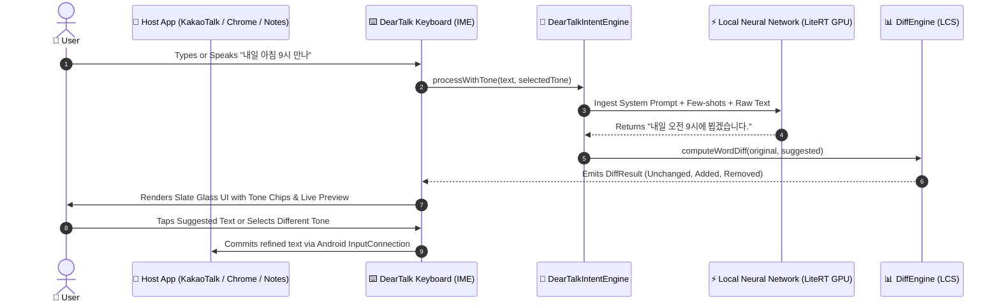

# ✨ DearTalkAI: 100% On-Device AI Communication Assistant

<div align="center">

[](#-android-keyboard)
[](#-core-principles)
[-success)](#-privacy--security-guarantee)
[](LICENSE)
[](https://github.com/smilelife/deartalk-ai/actions)

**DearTalkAI** is an open-source, privacy-first, 100% on-device AI communication assistant available as an **Android Custom Keyboard (IME)**.

It refines typed text and spoken voice (STT) with real-time, context-aware tone adjustments, typo correction, and multilingual translations — powered strictly by local on-device neural networks without any network connection.

> 📋 **Platform Note:** Currently Android-only. macOS and iOS support is planned for future releases.

[Key Features](#-key-platform-features) • [Before & After Samples](#-tone-transformation-samples) • [Architecture](docs/ARCHITECTURE.md) • [Long-Term Roadmap](docs/ROADMAP.md) • [Model Specs](docs/MODELS.md) • [Contributing](CONTRIBUTING.md)

</div>

---

## 📊 Platform Release Status

| Platform | Current Version | Status | Primary Features |
| :--- | :---: | :---: | :--- |
| 🤖 **Android** | `v1.3.0` | **Stable (Production)** | Custom Keyboard (IME), Offline STT, 6 Tones, In-App Model Downloader |
| 🍏 **macOS** | — | **Planned** | Under development (not yet included in this repository) |
| 📱 **iOS** | — | **Planned** | Under development (not yet included in this repository) |

---

## 🌟 Key Platform Features

### 📱 Android Keyboard (`deartalk-android`)
- **Offline Speech-to-Text (STT):** Instant offline voice recognition directly inside the keyboard.
- **6 Unified Tone Presets:** `✨ Refine`, `👔 Polite`, `😊 Casual`, `💼 Business`, `🤣 Humorous`, and `😼 Cheeky`.
- **Raw STT Preservation:** Multiple tone changes keep the original voice input intact while dynamically swapping AI outputs.
- **Compose-based Slate UI:** Modern dark glassmorphism keyboard with dedicated settings, test receiver, and haptic feedback.
- **In-App 1-Click Model Setup:** Automatic download and reactive state management for Gemma LiteRT models.


---

## 🎭 Tone Transformation Samples

| Tone Preset | Original Input (원문) | AI Refined Output (AI 제안문) |
|---|---|---|
| **✨ Refine (기본다듬기)** | 내일 아침 9시 만나 | 내일 아침 9시에 만나요. |
| **👔 Polite (공손하게)** | 식사 같이 하실래요? | 혹시 식사 함께 하실 수 있으실까요? |
| **😊 Casual (친근하게)** | 지금 어디야? | 지금 어디쯤이야? 😊 |
| **💼 Business (비즈니스)** | 자료 정리해서 보냈어 확인해 | 요청하신 업무 자료 송부해 드렸으니 확인 부탁드립니다. |
| **🤣 Funny (재미있게)** | 밥 먹으러 가자 | 밥 먹으러 안 가면 유죄! 같이 맛있는 거 먹으러 가요 🤣 |
| **😼 Cheeky (건방지게)** | 오늘 나랑 놀자 | 오늘 시간 비워둬, 내가 특별히 만나줄 테니까 😼 |

---

## 🔄 How It Works



---

## 🔒 Privacy & Security Guarantee

1. **Zero Fake Hardcoding (The 1st Principle):**
   - No `if/else`, substring matching, or regex-based grammatical hacks. All context, tones, and corrections are generated strictly through on-device LLM inference (Google Gemma).
2. **100% On-Device Privacy (Zero Network):**
   - 0% external network traffic. Keystrokes, voice audio, and text never leave the user's device.
3. **Engineering Transparency:**
   - Honest error handling and status indicators instead of fallback mock replies.

---

## 📁 Repository Structure

```
deartalk-ai/
├── .github/                    # CI/CD workflows and issue/PR templates
│   ├── workflows/build.yml     # Automated Android test/build pipeline
│   └── ISSUE_TEMPLATE/         # Bug report & feature request templates
│
├── deartalk-android/           # Android Keyboard Application (Kotlin, Jetpack Compose, LiteRT)
│   ├── src/main/java/ai/deartalk/android/
│   │   ├── agent/              # On-device Gemma LLM engine & prompt templates
│   │   ├── ime/                # Keyboard InputMethodService & Hangul automata
│   │   ├── data/               # SQLite repo with auto-pruning & preferences
│   │   └── stt/                # Offline SpeechRecognizer Manager
│   └── src/test/               # Common core JVM unit tests
│
└── docs/                       # Architecture diagrams, testing guides, and daily journals
    ├── ARCHITECTURE.md         # System architecture and data flow specifications
    └── TESTING.md              # Android testing standards
```

---

## 🚀 Quick Start & Build

### 📱 Android
```bash
# Run unit tests
./gradlew :deartalk-android:testDebugUnitTest

# Build and install on connected Android device (USB or Wi-Fi ADB)
./gradlew :deartalk-android:installDebug
```

---

## 🤝 Contributing & Community

We warmly welcome community contributions! Please read our:
- [Contributing Guide](CONTRIBUTING.md)
- [Code of Conduct](CODE_OF_CONDUCT.md)
- [System Architecture](docs/ARCHITECTURE.md)
- [Testing Guide](docs/TESTING.md)
- [Security Policy](SECURITY.md)

---

## 📄 License
This project is licensed under the **Apache 2.0 License** - see the [LICENSE](LICENSE) file for details.
