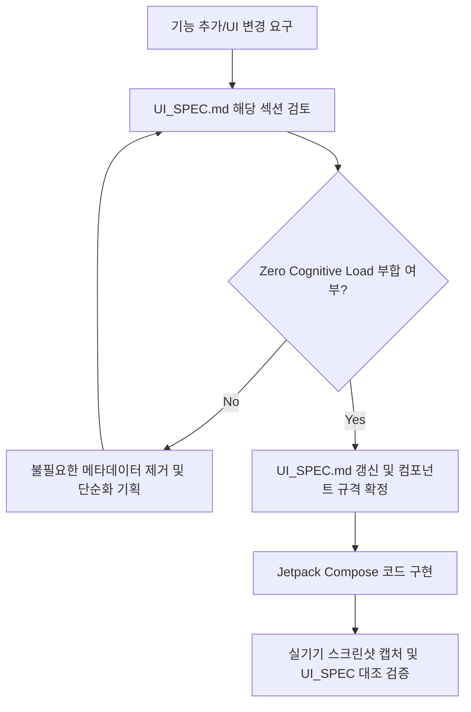

# 📱 DearTalk Android UI/UX Specification & Design System (UI_SPEC.md)

> **문서 상태**: v1.1.0 (Living Document)  
> **최종 수정일**: 2026-09-24  
> **적용 대상**: `ai.deartalk.android` (모바일 Jetpack Compose 전 영역)  
> **문서 목적**: AI 및 개발자가 무거운 소스 코드를 역추적하지 않고도 본 문서를 통해 즉시 UI 계층, 인터랙션 원칙, 컴포넌트 스펙, Do's & Don'ts를 완벽히 파악하고 검증할 수 있는 **단일 진실 공급원 (Single Source of Truth, SSOT)**.

---

## 🏛️ 1. 시니어 UI/UX 핵심 설계 철학: "Zero Cognitive Load"

일반 사용자가 언어 장벽을 넘어 1:1 대화에 몰입할 수 있도록, **"생각하지 않고 직관적으로 반응하는 인터페이스"**를 지향합니다.

1. **기술 은닉의 원칙 (Hidden Complexity)**:
   - 엔지니어링 메타데이터(세션 ID, SLM 모델명, 화행(Speech Act), 원시 프롬프트, 변환 전/후 디버그 칩 등)는 일반 사용자 화면에서 **100% 은닉**합니다.
   - 사용자는 "기술"을 사용하는 것이 아니라 "상대방과 대화"하는 것입니다.
2. **시각적 위계의 절대성 (Strict Visual Hierarchy)**:
   - 1순위 (Primary Focal Point): **상대방 언어로 번역된 최종 텍스트** (크고 선명한 청록색/Primary, 볼드)
   - 2순위 (Secondary Context): 내가 말한 원문 텍스트 (작고 차분한 회색조, 보조적 참조용)
   - 3순위 (Metadata Context): 발화 주체 및 언어 방향 (이모지 국기 기반 직관화)
3. **엄지손가락 영역 중심 조작성 (Thumb Zone Optimization)**:
   - 대화 중 가장 빈번하게 조작하는 핵심 컨트롤(발화 버튼, 청취 버튼, 톤 변경)은 반드시 화면 하단 1/3 영역(Natural Thumb Reach)에 배치합니다.

---

## 🎨 2. 디자인 토큰 및 시각 시스템 (Design Tokens)

### 2.1 컬러 팔레트 (Dark Mode First)
- **Background Root**: `Color(0xFF0F172A)` (Sleek Dark Navy Slate)
- **Surface / Card**: `Color(0xFF1E293B)` (Elevated Card Slate)
- **Primary Action / Accent**: `Color(0xFF14B8A6)` / `Color(0xFF2DD4BF)` (Vibrant Emerald-Teal - 시각적 피로도 감소 및 높은 명도 대비)
- **Speaker - My Bubble (나)**:
  - Background: `Color(0xFF132F2B)` (Deep Teal Tint)
  - Border: `Color(0xFF14B8A6).copy(alpha = 0.3f)`
- **Speaker - Partner Bubble (상대방)**:
  - Background: `Color(0xFF1E293B)` (Neutral Slate)
  - Border: `Color(0xFF334155)`
- **Text Primary (번역문)**: `Color(0xFFE2E8F0)` ~ `Color(0xFF5EEAD4)` (고대비 가독성)
- **Text Secondary (원문/타임스탬프)**: `Color(0xFF94A3B8)` (보조 가독성)

### 2.2 타이포그래피 스케일 (Typography Hierarchy)
| 구분 | 역할 | 폰트 크기 / 두께 | 적용 예시 |
| :--- | :--- | :--- | :--- |
| **Header Title** | 화면 최상단 타이틀 | `20sp` / SemiBold | `🎙️ DearTalk Live` |
| **Header Subtitle** | 세션 상태 안내 | `12sp` / Normal | `오전 10:12 시작` |
| **Bubble Translated (주)** | **핵심 번역 결과물** | `18sp` ~ `20sp` / Bold | **"Apa kabar hari ini?"** |
| **Bubble Original (부)** | 사용자 발화 원문 | `13sp` ~ `14sp` / Normal | "오늘 기분이 어떠세요?" |
| **Speaker Header** | 발화 주체 및 방향 | `12sp` / Medium | `🙋 나 🇰🇷 ➔ 🇮🇩` |
| **Button Label** | 주요 액션 버튼 | `15sp` / SemiBold | `내가 말하기` / `상대방 듣기` |

---

## 📐 3. 화면별 컴포넌트 상세 명세 (Component Specification)

### 3.1 상단 앱바 (TopAppBar) & 단일 세션 링 버퍼
- **단일 세션 200개 FIFO 링 버퍼 (Rolling Window)**:
  - 1:1 대면 통역의 즉시성을 위해 복잡한 세션 생성/분할 패러다임을 배제하고 **단일 타임라인에 최신 200개 메시지만 영구 유지(`O(1)`)**합니다.
  - 200개 초과 시 가장 오래된 메시지가 자동 탈락(Drop)되며, 상단에 불필요한 세션 ID나 시간 텍스트를 노출하지 않습니다.
- **구조**: `[뒤로가기] | [🎙️ DearTalk Live 타이틀] | [180° 대면 플립] [🧹 대화 비우기] [⚙️ 설정]`
- **액션**:
  - `[🔄 180° 플립]`: 상대방과 마주 앉았을 때 화면 상하 반전
  - `[🧹 대화 비우기]`: 팝업 확인 후 타임라인의 메시지를 즉시 0개로 리셋 (새로운 사람과 대화 시작 시)
  - `[⚙️ 설정]`: 통역 엔진 및 환경설정 다이얼로그

### 3.2 언어 선택 카드 (Dual Language Bar)
- **구조**: `[내 언어 카드 (좌)] ↔ [상대방 언어 카드 (우)]`
- **시각 요소**:
  - 활성 상태 표시: 초록색 펄스 점 (`🟢 사용 가능` / `Ready`)
  - 국가 표기: 텍스트 코드 대신 반드시 **국기 이모지 + 국문/현지어 명칭** 병기 (예: `🇰🇷 한국어`, `🇮🇩 인도네시아어`, `🇺🇸 English`)
  - 중앙 전환 버튼: `⇄` 터치 시 언어 쌍 즉시 스왑

### 3.3 대화 타임라인 및 말풍선 (Live Messenger Timeline)
- **Empty State (대화 시작 전)**:
  - 마이크가 중앙에 은은하게 애니메이션되는 안내 카드 표시
  - 문구: *"아래 [내가 말하기] 버튼을 누르고 편하게 말씀하세요"*
- **Message Bubble Layout (말풍선 레이아웃)**:
  ```
  [🙋 나 🇰🇷 ➔ 🇮🇩]                                  (우측 상단 라벨)
  ┌───────────────────────────────────────────────┐
  │ 🎙️ 지금 어디가세요?                           │ (원문: 작고 차분함)
  │                                               │
  │ 🤖 Anda sedang ke mana sekarang?             │ (번역문: 크고 선명함)
  │                                               │
  │ 오전 10:33                   [🔊 듣기] [📋 복사]│ (하단 메타 & 액션)
  └───────────────────────────────────────────────┘
  ```
- **Do's & Don'ts**:
  - ❌ 절대 금지: `⚡ 변환 전: ...` 칩 표시 (번역 전 미완성 텍스트를 완성된 버블에 덧붙이지 말 것)
  - ❌ 절대 금지: `✨ AI 맞춤 다듬기`, `Cheeky`, `Formal` 같은 기술 라벨을 버블 본문에 중복 노출하지 말 것 (상단 프리셋 칩에 이미 표시됨)
  - ✅ 필수 권장: 번역문 터치 또는 스피커 아이콘 터치 시 현지어 TTS 즉시 재생

### 3.4 톤/스타일 프리셋 바 (Tone & Style Chips)
- **위치**: 타임라인 상단 또는 하단 컨트롤 직전의 슬림 바
- **옵션**:
  - `✨ 기본 다듬기` (Refine - 깔끔하고 자연스러운 표준 표현)
  - `🤝 정중하게` (Polite / Formal - 비즈니스 및 공적인 자리)
  - `💬 편안하게` (Casual - 친구 사이)
  - `😼 당당하게` (Cheeky - 재치 있고 분명한 어조)
- **원칙**: 선택된 톤은 버블 내부가 아니라 **상단 칩의 활성화 상태(Highlight Border)**로만 조용히 표현.

### 3.5 하단 음성 컨트롤 바 (Push-to-Talk & Listening Bar)
- **구조**: 대형 2-Button 레이아웃 (좌: 내 발화 / 우: 상대방 청취)
  - 좌측 버튼: `🎙️ 내가 말하기` (내 언어로 마이크 입력 시작)
  - 우측 버튼: `👂 상대방 듣기` (상대방 언어로 마이크 입력 시작)
- **인터랙션 피드백 (Micro-Interactions)**:
  - 터치 중(Holding / Active): 테두리에 부드러운 Pulse 광선 및 마이크 아이콘 스케일 업 애니메이션
  - 입력 완료 시: 가벼운 햅틱 피드백 (`HapticFeedbackConstants.CONFIRM`)
  - 번역 진행 중 (약 0.5~1초): 텍스트 영역에 가벼운 Shimmer/Wave 효과

### 3.6 메인 설정 및 온보딩 허브 명세 (MainActivity - Setup & Settings Hub)

메인 액티비티는 사용자가 앱을 설치한 후 **키보드를 1분 만에 세팅하고, 온디바이스 동작을 체감하며, 환경을 맞춤 설정**하는 중심 관제탑(Hub) 역할을 수행합니다.

#### 3.6.1 사용자 인지 흐름 (8-Step Information Funnel)
사용자의 인지 부하(Cognitive Load)를 최소화하기 위해 아래와 같은 논리적 여정으로 카드를 순차 배치합니다:
1. **온보딩 (Onboarding)** ➔ `🚀 1분 키보드 빠른 시작`
2. **보안 신뢰 (Trust & Status)** ➔ `🔒 100% 온디바이스 안심 보호`
3. **즉각 체험 (Sandbox)** ➔ `🎙️ 실시간 음성 & AI 체험하기`
4. **확장 기능 (Pro Feature)** ➔ `🎙️ DearTalk Live (1:1 대면 통역)`
5. **통합 제어 (Settings Hub)** ➔ `⚙️ 키보드 환경 설정` (모드 + 기본자판 + 언어 + 무음감지)
6. **실전 팁 (Usage Guide)** ➔ `📖 DearTalk AI 쉽게 쓰는 법`
7. **프라이버시 보증 (Privacy Guarantee)** ➔ `🛡️ 100% Zero-Persistence 프라이버시`
8. **안전망 (User Freedom)** ➔ `⌨️ 키보드 언제든 변경 / 전환` & `ℹ️ 앱 정보`

#### 3.6.2 카드별 UI 컴포넌트 세부 규격
| 카드 번호 / 타이틀 | 핵심 역할 | 주요 UI 요소 및 컴포넌트 스펙 | UX 핵심 규칙 |
| :--- | :--- | :--- | :--- |
| **Card 1: 🚀 1분 키보드 빠른 시작** | 필수 키보드 2단계 활성화 | • 1단계: 키보드 활성화 (체크박스/완료)<br>• 2단계: 기본 키보드 선택 (액션 버튼) | 최상단 고정. 설치 직후 진입장벽을 제거하는 핵심 온보딩. |
| **Card 2: 🔒 100% 온디바이스 안심 보호** | 하드웨어/엔진 상태 실시간 진단 | • 인식 언어 태그 (`🇰🇷 한국어 (시스템 기본)`)<br>• `온디바이스 실시간 처리` 뱃지<br>• 보안/동작 상태 표 (정상 작동 / 로컬 오프라인 / 100% 안전) | 순수 시스템/보안 상태만 표시 (키보드 타자 설정 등 이질적 요소 배제). |
| **Card 3: 🎙️ 실시간 음성 & AI 체험하기** | 다른 앱 이동 없이 즉시 테스트 | • 대형 마이크 토글 버튼 (`마이크 켜고 말씀하기`)<br>• 예시 문장 테스트 칩<br>• `답장 작성하기` 키보드 팝업 영역 | 즉각적인 도파민 제공. 음성 인식 및 AI 보정 결과를 인앱에서 즉시 체험. |
| **Card 4: 🎙️ DearTalk Live** | 1:1 실시간 대면 통역 스튜디오 진입 | • 양방향 번역 아이콘 (`Icons.Default.Translate`)<br>• 기능 설명 서브텍스트<br>• `열기 ➔` 바로가기 버튼 | **상시 노출 (Discoverability 보장)**. 모드 전환 없이도 독립 액티비티 즉시 실행 가능. |
| **Card 5: ⚙️ 키보드 환경 설정** | 키보드 입력과 관련된 모든 설정 응집 | 1. `🎛️ 키보드 사용 모드` (기본 모드 vs 프로 모드 2-Tab Box)<br>2. `⌨️ 기본 한글 자판` (두벌식 vs 천지인 토글 세그먼트)<br>3. `⚙️ 기본 언어 자동 맞춤` (시스템 동기화 스위치 & 수동 언어 칩) | **응집도의 원칙 (Cohesion)** 및 **기술 은닉(Hidden Complexity)**. 모드/자판/언어 등 직관적 설정만 유지하고, 무음 감지 시간은 단문/장문 구분 없이 **10.0초 단일 안전 대기**로 완전 자동화 (말씀 완료 시 [입력] 버튼으로 0ms 즉시 전송). |
| **Card 6: 📖 DearTalk AI 쉽게 쓰는 법** | 카카오톡/문자 실전 사용 팁 | • 1~5단계 번호형 텍스트 가이드<br>• 마이크 버튼 및 입력 완료 버튼 아이콘 매핑 | 설정을 완료한 사용자가 실전 메신저에서 어떻게 쓰는지 바로 안내. |
| **Card 7: 🛡️ 100% Zero-Persistence 프라이버시** | 데이터 무저장 보증 | • 레드/실버 쉴드 아이콘<br>• Zero-Data Retention 정책 안내 (로컬 및 원격 저장 0%) | 법적/윤리적 신뢰 구축 및 사용자 안심 유도. |
| **Card 8: ⌨️ 키보드 언제든 변경 / 전환** | 기존 키보드로의 탈출구 제공 | • `🔄 다른 키보드로 바로 전환하기` 풀 너비 버튼 (`DearTalkSecondary`) | **닐슨 휴리스틱 #3 (User Control & Freedom)** 준수. 언제든 삼성/Gboard로 원복 가능함을 보장. |
| **Card 9: ℹ️ 앱 정보 및 도움말** | 앱 버전 및 패키지 메타데이터 | • 앱 이름, 버전(`v1.1.4`), 업데이트 일시, 보안 등급 명시 | 투명한 버전 관리 및 디버깅 참조. |

---

## 🚫 4. UI/UX 안티패턴 체크리스트 (절대 금지 사항)

코드 작성 및 리뷰 시 아래 항목 중 하나라도 발견되면 즉시 리팩토링 대상입니다:

1. ❌ **엔지니어링 용어 노출**: `SLM`, `화행`, `LLM`, `Gemma`, `Token`, `Prompt`, `Inference Latency`, `Session ID (타임스탬프 해시)`를 사용자 대면 UI에 노출하는 행위.
2. ❌ **정보 과밀(Cluttering)**: 하나의 말풍선 안에 원문, 초안, 최종안, 의도, 점수 등 4개 이상의 칩/텍스트 덩어리를 욱여넣는 행위.
3. ❌ **고정 텍스트 크기(dp) 오남용**: 시스템 폰트 크기 변경(Accessibility Font Scaling)에 대응하지 못하는 고정 텍스트 높이 하드코딩.
4. ❌ **터치 타깃 미달**: 주요 버튼의 클릭 가능 영역이 `48dp x 48dp` 미만인 경우 (손가락 미스터치 유발).
5. ❌ **불분명한 에러 메시지**: 오프라인 상태이거나 마이크 권한이 없을 때 기술적 Exception 클래스명을 그대로 토스트로 띄우는 행위.

---

## 📋 5. 기능/화면 변경 시 표준 리뷰 절차 (Standard Review Flow)

새로운 기능을 추가하거나 화면을 수정할 때는 **코드보다 먼저 본 문서를 검토**합니다:



1. **사전 검토**: 변경하려는 요소가 기존 시각적 위계(Visual Hierarchy)를 해치지 않는지 확인.
2. **스펙 우선 반영**: 본 `UI_SPEC.md`에 레이아웃, 컬러, 폰트, 문구 변경 사항을 먼저 기술.
3. **코드 구현**: 확정된 스펙을 기반으로 Compose 컴포넌트 수정.
4. **실기기 검증**: 실기기 캡처를 통해 `UI_SPEC.md`와 1:1 일치 여부 확인.
