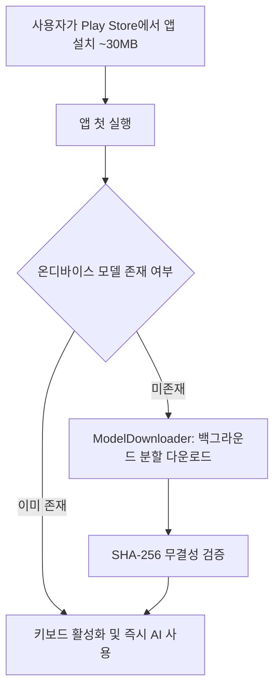

# 📱 DearTalk AI Android: Google Play Store 상용 배포 가이드라인

이 문서는 `origin/deartalk-ai`의 Android 모듈(`deartalk-android`)을 **Google Play Store에 안정적으로 출시하고 업데이트하기 위한 시니어 앱 개발자 표준 배포 가이드**입니다.

---

## 📋 1. Google Play 출시 전 필수 점검 체크리스트 (Pre-flight Checklist)

| 구분 | 검증 항목 | 점검 기준 | 상태 |
| :--- | :--- | :--- | :---: |
| **SDK 버전** | `compileSdk`, `targetSdk` | 최신 Google Play 기준 충족 (`targetSdk = 34`, Android 14) | ✅ Pass |
| **최소 지원 버전** | `minSdk` | Android 8.0 Oreo (`minSdk = 26`) | ✅ Pass |
| **앱 번들 형식** | 배포 아티팩트 | 반드시 `.aab` (Android App Bundle) 포맷 사용 | ⏳ 진행 중 |
| **코드 난독화 & 축소** | R8 / Proguard | `isMinifyEnabled = true`, JNI Native Keep 룰 적용 | ⏳ 진행 중 |
| **앱 서명 (Signing)** | Release Keystore | RSA 2048+ / PKCS12 키 분리 관리 (`keystore.properties`) | ⏳ 진행 중 |
| **보안 & 테스트 격리** | `DearTalkTestReceiver` | Release 빌드 매니페스트에서 완전 제외 | ⏳ 진행 중 |
| **앱 아이콘 & 그래픽** | Adaptive Icon | `@mipmap/ic_launcher` 프로덕션 에셋 적용 | ⏳ 준비 |
| **데이터 안전성** | Play Console Data Safety | 온디바이스 Zero-Network 처리 명시 (오디오/키스트로크) | 📝 정책 수립 |

---

## 🔑 2. 안전한 Keystore 서명 관리 (`signingConfigs`)

릴리즈 서명 키(`release.keystore` / `*.jks`)와 비밀번호는 **절대 Git 저장소에 커밋해서는 안 됩니다.**

### A. 로컬 환경: `keystore.properties` 분리
`deartalk-android/keystore.properties` 파일을 생성하고 `.gitignore`에 등록하여 관리합니다:

```properties
# deartalk-android/keystore.properties (Git 커밋 절대 금지)
RELEASE_STORE_FILE=../secrets/deartalk-release.keystore
RELEASE_STORE_PASSWORD=your_secure_store_password
RELEASE_KEY_ALIAS=deartalk_release_key
RELEASE_KEY_PASSWORD=your_secure_key_password
```

### B. CI/CD 환경: 환경 변수 주입
GitHub Actions 또는 CI 빌드 환경에서는 Secret 환경변수를 통해 주입합니다:
- `DEARTALK_KEYSTORE_BASE64`
- `DEARTALK_KEYSTORE_PASSWORD`
- `DEARTALK_KEY_ALIAS`
- `DEARTALK_KEY_PASSWORD`

---

## 🛡️ 3. R8 / Proguard 최적화 및 C++ JNI Keep 규칙

온디바이스 AI 앱은 C++ 네이티브 바이너리(Google LiteRT, MediaPipe)와 JNI 인터페이스로 통신하므로, R8 난독화 시 네이티브 인터페이스가 삭제(Shrink)되면 런타임 크래시(`UnsatisfiedLinkError`)가 발생합니다.

### `proguard-rules.pro` 필수 보존 대상:
1. **Google LiteRT-LM & MediaPipe GenAI**:
   - `com.google.ai.edge.litertlm.**`
   - `com.google.mediapipe.tasks.genai.**`
2. **Jetpack Compose Runtime & UI State**:
   - Compose 내부 컴파일러 메타데이터 및 상태 클래스
3. **Room Database / SQLite Entities & DAOs**:
   - `ai.deartalk.android.data.repository.**`
4. **한글 오토마타 및 모델 데이터 모델**:
   - `ai.deartalk.android.ime.HangulComposer`
   - `ai.deartalk.android.data.pref.**`

---

## 🧠 4. 온디바이스 AI 모델 배포 전략 (대용량 모델 처리)

Google Play Store의 **단일 AAB 기본 다운로드 제한은 200MB**입니다.  
Gemma 기반 온디바이스 모델(`.litertlm`, 약 1.0GB ~ 1.5GB)은 다음 중 하나의 방식으로 배포합니다:



1. **인앱 백그라운드 다운로더 (현재 채택 방식)**:
   - 앱 AAB 크기는 약 25~35MB로 초경량 유지 (빠른 스토어 다운로드 유도).
   - 앱 최초 실행 시 `ModelDownloader`가 공인 스토리지(CDN/HuggingFace)에서 모델을 다운로드하고 SHA-256 해시를 검증.
2. **Play Asset Delivery (PAD) 방식 (향후 확장 옵션)**:
   - `install-time` 또는 `fast-follow` 에셋 팩을 통해 Google Play 인프라에서 직접 번들링 제공.

---

## 🔒 5. Play Console Data Safety & 권한 정책 작성 가이드

DearTalk AI는 **100% On-Device AI**이므로 구글 심사 시 매우 유리한 위치에 있습니다. 단, IME(키보드) 및 오디오 권한을 요구하므로 심사 시 명확한 소명이 필요합니다.

### A. 사용 권한 및 목적
- `android.permission.RECORD_AUDIO`: 키보드 내 음성 인식(STT) 마이크 입력용
- `android.permission.VIBRATE`: 키 입력 시 햅틱 피드백 제공용
- `android.permission.BIND_INPUT_METHOD`: 시스템 키보드 서비스 등록용

### B. Play Console "데이터 안전(Data Safety)" 답변 요령
- **데이터 수집 여부**: **수집 안 함 (No data collected)**
- **데이터 공유 여부**: **공유 안 함 (No data shared)**
- **오디오 데이터(Voice)**:
  - *“사용자의 음성 데이터는 기기 내부(On-device)에서 실시간으로 텍스트로 변환된 후 즉시 메모리에서 소멸되며, 외부 서버로 전송되거나 저장되지 않습니다.”*
- **개인정보처리방침(Privacy Policy)**:
  - GitHub Pages 또는 공식 도메인의 Privacy Policy URL을 반드시 Play Console에 등록.

---

## 📦 6. 릴리즈 빌드 및 배포 절차

```bash
# 1. 테스트 실행 및 린트 검증
./gradlew :deartalk-android:testDebugUnitTest

# 2. Release AAB (Android App Bundle) 빌드
./gradlew :deartalk-android:bundleRelease

# 3. 산출물 위치 확인
# -> deartalk-android/build/outputs/bundle/release/deartalk-android-release.aab

# 4. Play Console 내부 테스트(Internal Test) 트랙에 업로드 및 검증
```

---

## 🏷️ 7. 버전닝 및 태그 전략

- `versionCode`: 매 릴리즈마다 `+1` 단조 증가 (예: `1`, `2`, `3` ...)
- `versionName`: `Semantic Versioning` 준수 (예: `v1.0.0`)
- 배포 완료 시 Git 태그 생성:
  ```bash
  git tag -a v1.0.0 -m "Release v1.0.0: Initial Google Play Store Production Release"
  git push origin v1.0.0
  ```
