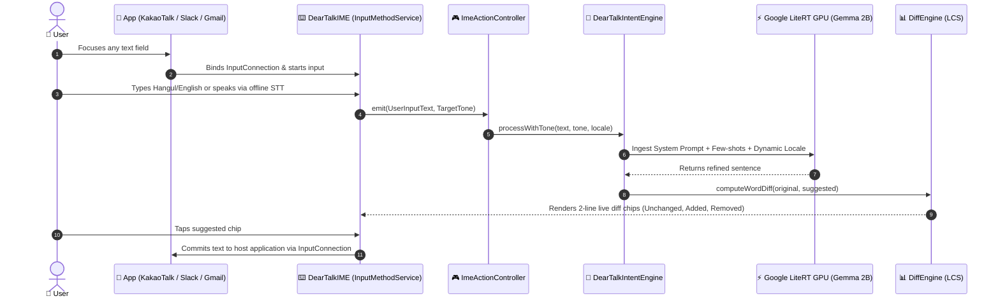

# 🏛️ DearTalkAI System Architecture (Android IME)

This document provides a comprehensive technical overview of **DearTalkAI**'s Android architecture, data flow, Compose IME lifecycle, and on-device neural inference pipeline.

---

## 🎯 System Architecture Diagram

```mermaid
graph TD
    subgraph Client Layer (Android 15 / API 35)
        A[DearTalkIME: InputMethodService] --> B1[Hangul Composer & Keyboard Automata]
        A --> B2[Offline SpeechRecognizer Manager STT]
        A --> B3[ImeActionController: Flow State Machine]
    end

    subgraph Core Engine Layer
        B3 --> C[DearTalkIntentEngine: Prompt Builder]
        C --> D[CustomToneManager: 6 Tone Presets]
        C --> E[DiffEngine: LCS Word-Level Diff Matrix]
    end

    subgraph Hardware Accelerated On-Device AI
        C --> F[Google LiteRT GPU Delegate]
        F --> G[(Google Gemma 2B Quantized .litertlm)]
        H[Google Play Asset Delivery PAD / Local ADB] -.-> G
    end

    subgraph UI & Output Pipeline
        E --> I[Modular Jetpack Compose Keyboard]
        I --> J[2-Line Live Diff Suggestions Canvas]
        J --> K[Android InputConnection: Text Commit]
    end
```

---

## 🔄 End-to-End Execution Flow



---

## 🧩 Core Subsystems

### 1. `DearTalkIME` & `ImeActionController`
- **Role:** Implements Android's `InputMethodService` and orchestrates keyboard lifecycle events, view compositions, and soft input connections.
- **Decoupled Architecture:** Separates the Android framework lifecycle from business logic using `ImeActionController` and immutable `ImeUiState` for 100% JVM testability.
- **Hangul Automata (`HangulComposer`):** High-performance 2-Bulsik vowel/consonant composition and decomposition engine handling syllable formation, final consonants (Jongseong), and backspace boundaries.

### 2. `DearTalkIntentEngine`
- **Role:** Centralized coordinator for prompt templating, few-shot contextualization, and LiteRT execution.
- **Dynamic Locale Injection:** Dynamically extracts the active Android `Locale` (Korean, English, Indonesian, Japanese, Spanish) and injects target-language constraints into Gemma prompts.
- **Invariant (The 1st Principle):** If the LiteRT model is initializing or unavailable, the engine **honestly preserves 100% of the raw user input** without appending fake heuristic suffixes.

### 3. `DiffEngine` (Longest Common Subsequence)
- **Role:** Token-level diff calculator that compares original input with AI suggestions to produce granular `.unchanged`, `.removed`, and `.added` visual badges.
- **Complexity:** Optimized $O(N \times M)$ Dynamic Programming matrix with empty-token guards and token boundary preservation.

### 4. `LiteRtEngine` & Model Lifecycle
- **Role:** On-device neural network execution using Google's official LiteRT GPU delegate.
- **Google Play Asset Delivery (PAD):** Distributes the Gemma model via Google Play's `install-time` or `fast-follow` asset packs, or loads from local ADB paths (`/data/local/tmp/llm/`, `/data/data/ai.deartalk.android/files/models/`).
- **No Unauthorized Downloads:** 0% external HTTP network downloader dependencies.

---

## 📚 Related Documentation
- [Android Google Play Deployment Guide](ANDROID_DEPLOYMENT_GUIDE.md)
- [Automated Testing & Verification Guide](TESTING.md)
- [On-Device Model Compatibility Specifications](MODELS.md)
- [Long-Term Technology Roadmap](ROADMAP.md)
