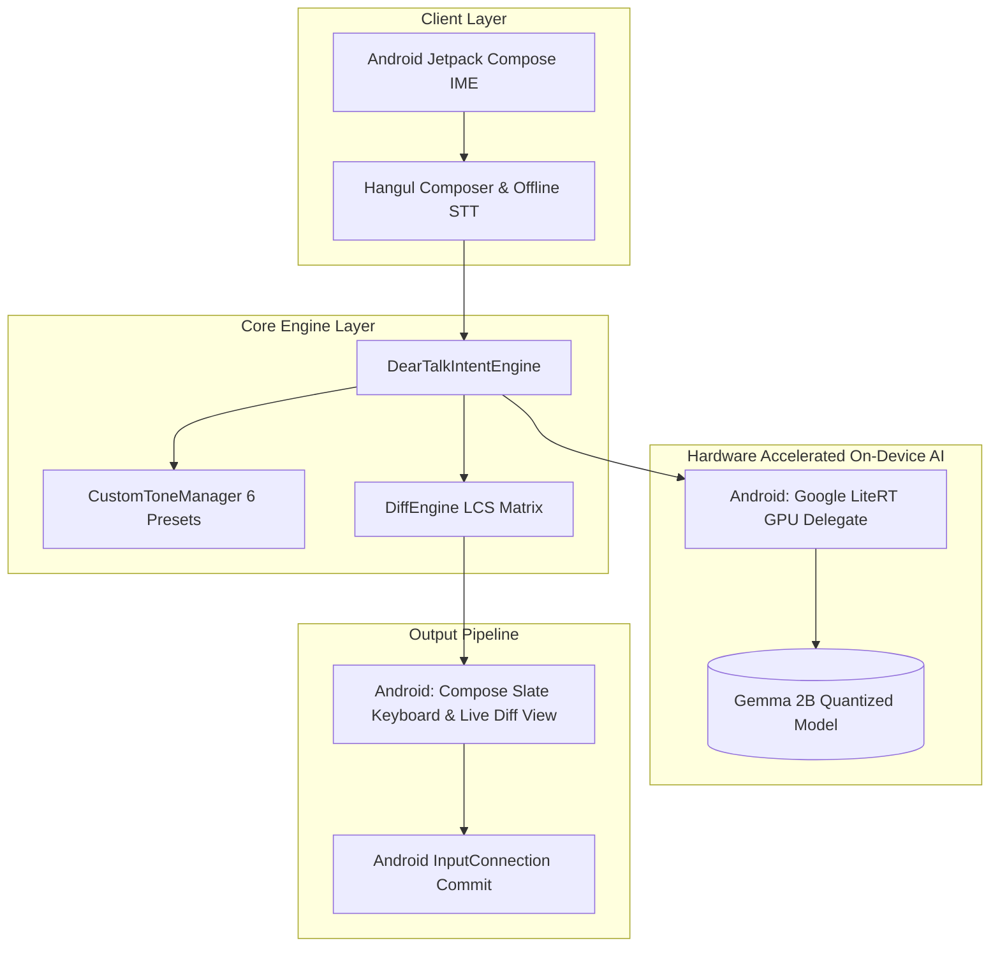
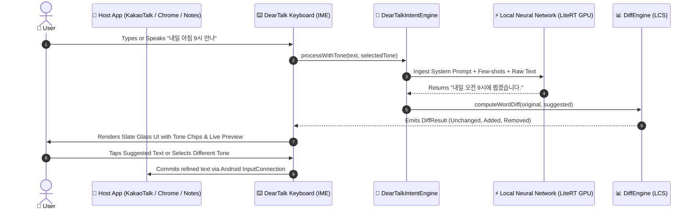

# 🏛️ DearTalkAI System Architecture

This document provides a comprehensive technical overview of **DearTalkAI**'s Android on-device AI keyboard architecture, data flow, and inference lifecycle.

---

## 🎯 Architecture Diagram

---

## 🔄 End-to-End Execution Flow (Android IME)

---

## 🧩 Core Subsystems

### 1. `DearTalkIntentEngine`
- **Role:** Centralized orchestrator for local LLM inference.
- **Inference Backend:** Google LiteRT GPU delegate (`ai.deartalk.android.agent.LiteRtEngine`).
- **Safety Invariant (The 1st Principle):** When the model is loading or unavailable, it **honestly preserves 100% of the original text** without appending fake grammatical hacks.

### 2. `DiffEngine` (Longest Common Subsequence)
- **Role:** Word/token-level diff calculator that breaks sentences into `.unchanged`, `.removed`, and `.added` operations.
- **Complexity:** $O(N \times M)$ DP matrix with empty-token guards and consecutive operation merging.

### 3. `DearTalkIME` & `HangulComposer`
- **Role:** Android `InputMethodService` implementation providing custom Compose keyboard with real-time on-device tone suggestions.
- **Hangul Automata:** 2-Bulsik vowel/consonant composition and decomposition engine handling syllable formation and backspace boundaries.
- **In-App Model Lifecycle:** `ModelDownloader` dynamically loads Gemma `.litertlm` into RAM with GPU acceleration.

---

## 📚 Related Documentation
- [Android Google Play Deployment Guide](ANDROID_DEPLOYMENT_GUIDE.md)
- [Long-Term Technology Roadmap](ROADMAP.md)
- [On-Device Model Compatibility Specifications](MODELS.md)
- [Android Testing Specifications](TESTING.md)
