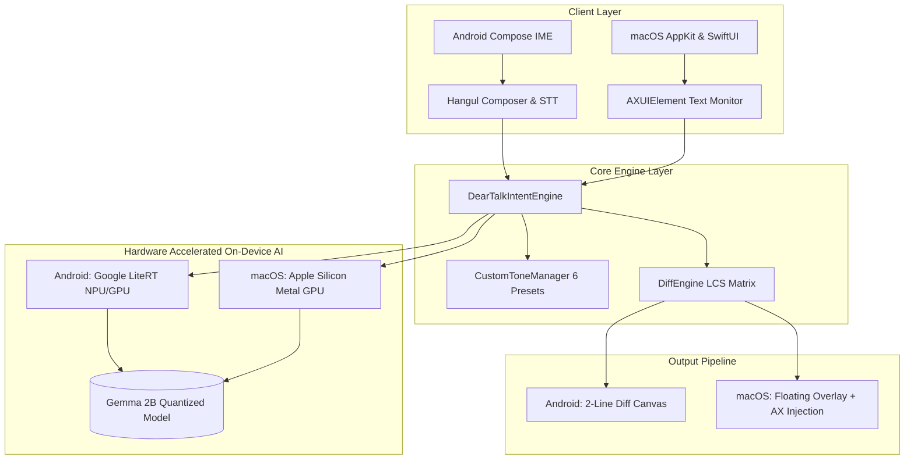
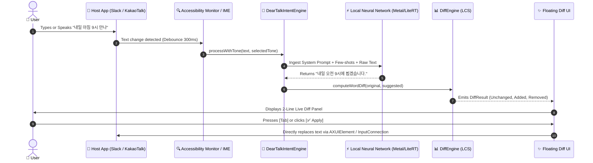

# 🏛️ DearTalkAI System Architecture

This document provides a comprehensive technical overview of **DearTalkAI**'s cross-platform architecture, data flow, and on-device inference lifecycle.

---

## 🎯 Architecture Diagram

---

## 🔄 End-to-End Execution Flow (macOS & Android)

---

## 🧩 Core Subsystems

### 1. `DearTalkIntentEngine`
- **Role:** Centralized orchestrator for local LLM inference across platforms.
- **Inference Backends:**
  - **macOS:** Apple Silicon Metal GPU hardware acceleration via `llama-server` on port 11435.
  - **Android:** Google LiteRT GPU delegate (`ai.deartalk.android.agent.LiteRtEngine`).
- **Safety Invariant (The 1st Principle):** When the model is loading or unavailable, it **honestly preserves 100% of the original text** without appending fake grammatical hacks.

### 2. `DiffEngine` (Longest Common Subsequence)
- **Role:** Word/token-level diff calculator that breaks sentences into `.unchanged`, `.removed`, and `.added` operations.
- **Complexity:** $O(N \times M)$ DP matrix with empty-token guards and consecutive operation merging.

### 3. `AccessibilityMonitor` & `TextReplacementService` (macOS)
- **Role:** Queries focused elements across macOS applications using `AXUIElementCopyAttributeValue` and translates global Top-Left coordinates to Cocoa Bottom-Left space.
- **Awakening Mechanism:** Emits `AXEnhancedUserInterface = true` to activate lazy accessibility trees in Electron/Chromium apps (VS Code, Antigravity IDE, Slack, Chrome).

### 4. `UiStrings` (Multilingual Engine)
- **Role:** Automatically determines whether to render Korean (`ko`) or English fallback based on system preferences (`Locale.preferredLanguages` / `Locale.getDefault()`).

---

## 📚 Related Documentation
- [Long-Term Technology Roadmap](ROADMAP.md)
- [On-Device Model Compatibility Specifications](MODELS.md)
- [Cross-Platform Testing Specifications](TESTING.md)
